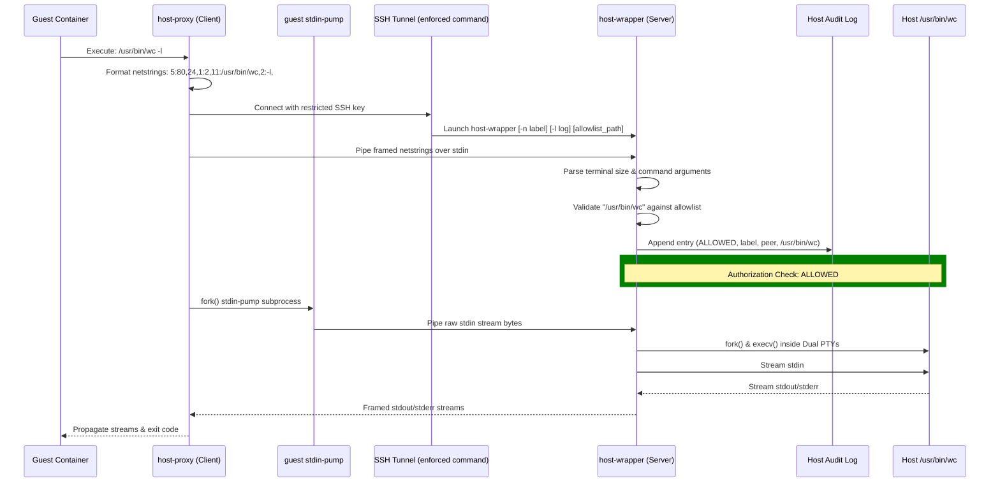

# Host-wrapper

[](https://opensource.org/licenses/MIT)
[](https://en.wikipedia.org/wiki/C_(programming_language))
[](https://llvm.org/docs/LibFuzzer.html)

A lightweight command-execution gateway designed to bridge isolated development containers and virtual machines (VMs) with the host operating system's command line interface (CLI). It allows containers to run explicitly allowed host-side commands directly from and isolated container or VM. Implemented with POSIX-compliant C and shell scripts.

---

## Table of Contents

- [Introduction](#introduction)
- [Purpose and Motivation](#purpose-and-motivation)
  - [The Security Problem](#the-security-problem)
  - [The host-wrapper Solution](#the-host-wrapper-solution)
  - [Why C and POSIX?](#why-c-and-posix)
- [Technical Architecture](#technical-architecture)
  - [Stream Multiplexing and Netstring Framing](#stream-multiplexing-and-netstring-framing)
  - [Exit Status](#exit-status)
- [POSIX and OS Compatibility](#posix-and-os-compatibility)
- [Multi-Project Architecture](#multi-project-architecture)
- [Security Design](#security-design)
  - [Key Security Features](#key-security-features)
  - [SECURITY DISCLAIMER](#security-disclaimer)
- [Installation and Usage](#installation-and-usage)
  - [Prerequisites](#prerequisites)
  - [1. Build from Source](#1-build-from-source)
  - [2. Host-Side Installation](#2-host-side-installation)
  - [3. Client-Side Integration](#3-client-side-integration)
- [Integration Examples](#integration-examples)
- [Running the Tests](#running-the-tests)
- [Omitted Features and Intended Constraints](#omitted-features-and-intended-constraints)
- [Possible Future Development](#possible-future-development)
- [License](#license)
- [AI Tooling Disclosure](#ai-tooling-disclosure)

---

## Introduction

host-wrapper is a dual-component client-server utility:
- **host-wrapper (Server)**: A binary installed on the host system. It intercepts incoming commands via an SSH restricted shell, validates them against an allowlist, and executes approved programs inside a target workspace directory.
- **host-proxy (Client)**: A binary run inside the guest container or VM. It captures standard streams (stdin, stdout, stderr), captures window terminal size configurations, serializes command and its arguments using netstring framing, and forwards them across the SSH tunnel to the host-wrapper via SSH.

---

## Purpose and Motivation

Isolated development workspaces (such as Docker containers, Nix-shell environments, and Apple Container Machines) provide security by isolating the workspace from the host operating system (OS). However, developers may need to invoke host-side system utilities or platform-specific tools from inside these guests:
- **Compilers and Hardware-Accelerated Linkers** (e.g., Apple Clang, Metal compiler, host toolchains).
- **Security Key Access** (e.g., triggering host-side GPG, Git commit signing, SSH agents).
- **Proprietary/Local APIs and System Commands**.

### The Security Problem
Quick workarounds for host access compromise security boundaries:
- **Volume Mounting home directory**: Exposes SSH keys, personal secrets, and configuration files to untrusted guest packages inside containers.
- **SSH Passwordless Sudo**: Invalidates the security isolation of virtualization entirely.

### The host-wrapper Solution
Host-wrapper treats the host as a restricted remote RPC server. By utilizing native SSH forced-commands (`command="..."` in `authorized_keys`), the guest container is granted access to exactly and only the commands specified in a host-side allowlist. There are:
- No bind mounts or volume leakage.
- No privilege escalation (runs as a configurable host user).

### Why C and POSIX?
- **Zero Runtime Dependencies**: Both the client (`host-proxy`) and server (`host-wrapper`) require no external package managers, language runtimes (such as Python, Node.js, or Go), or shared runtime libraries. They can run easily in highly constrained busybox or scratch Alpine containers.
- **Extreme Portability**: The code relies strictly on standard POSIX C system APIs, allowing it to compile cleanly on any POSIX-compliant guest or host platform (macOS, Linux, Alpine, BSD, etc.).
- **Minimal Overhead**: Spawning a lightweight compiled binary over an SSH tunnel introduces negligible execution latency.

---

## Technical Architecture



### Stream Multiplexing and Netstring Framing
Since SSH only provides a single stream for bidirectional communication, host-wrapper implements netstring framing (format: `[length]:[payload],`) to transparently multiplex:
1. Terminal size (columns and rows) to preserve PTY wrapping.
2. Formatted argument arrays (`argc` and `argv`).
3. Standard streams (`stdin`, `stdout`, `stderr`) without mixing boundaries.
4. Exit status propagation of the executed host command.

#### Argument Serialization Format
The `argv` array is serialized as a sequence of netstrings, prefixed by a netstring representing `argc`.
Format:
```text
[argc netstring][arg0 netstring][arg1 netstring]...[remaining stdin payload]
```
For example, executing `/usr/bin/wc -l` translates to:
```text
1:2,11:/usr/bin/wc,2:-l,
```
Because the wrapper parses `stdin` byte-by-byte up to the exact end of the header, the invoked target process natively inherits the remaining raw bytes on the standard input file descriptor.

To guarantee terminal compliance and color support, approved host processes are spawned inside Dual PTY streams (separating stdout and stderr), mimicking native host execution.

### Exit Status
`host-proxy` exits with the target's status. Codes from 125 up follow the shell convention and report a command that did not run to completion:

| Code    | Meaning                                                            |
|---------|--------------------------------------------------------------------|
| 0–124   | Exit status of the target                                          |
| 125     | host-proxy or host-wrapper failed, e.g. a malformed request        |
| 126     | Command denied by the allowlist                                    |
| 127     | Command allowlisted but could not be executed                      |
| 128+*n* | Target killed by signal *n*                                        |
| 255     | `ssh` failed to connect; also what a target exiting 255 reports    |

---

## Security Design

There is a test script that test behaviour and key security features. The host-side netstring and argument parser have been extensively fuzzed under AddressSanitizer and UndefinedBehaviorSanitizer to test for memory leaks, crashes, and out-of-bounds access.

### Key Security Features
1. **Enforced SSH Command Context**: The client's public key in the host's `~/.ssh/authorized_keys` file is restricted using `command="/path/to/host-wrapper -n label -l /path/to/audit.log /path/to/allowlist",no-pty,no-port-forwarding,no-X11-forwarding,no-agent-forwarding`. This guarantees that even if a guest container is compromised, it can only invoke the host-wrapper via SSH.
2. **Working Directory Mapping**: Before executing an approved host command, host-wrapper changes its working directory (`chdir`) to the directory containing the allowlist file. This serves as a convenience, allowing host commands to resolve file paths relative to workspace directory.
3. **Strict Command Validation**:
   - A command is named either absolutely, or relative to the allowlist directory, which is where it runs: `/usr/bin/uname` or `./build.sh`. A name that is neither — a bare `uname`, or anything with a `..` component — is refused when the allowlist is read, before any request is served.
   - Entry and request are both resolved against that directory and then compared, so the string compared is the file executed. Nothing is looked up on `PATH`: an allowlist naming `/usr/bin/uname` permits `/usr/bin/uname`, and not `uname`.
   - Standard input redirection from proxy to host is blocked by default for all allowed commands unless explicitly overridden in the allowlist using the `+stdin` option.
4. **Resilient Shell/Injection Prevention**: The wrapper bypasses the shell completely by invoking processes directly using `execv()`. There is no shell evaluation of arguments, preventing command-injection attacks.
5. **Audit Logging**: Every attempt, `ALLOWED` or `DENIED`, is recorded on the host:

   ```text
   [2026-09-21 20:09:44] [ALLOWED] [project-a] [192.168.64.3 51000] /usr/bin/uname -a
   ```

   - The label is `-n <label>` from the forced command and the peer is sshd's `SSH_CONNECTION`, so an entry names the key that asked rather than anything the guest sends.
   - `-l <path>` places the log; the default is `${XDG_STATE_HOME:-$HOME/.local/state}/host-wrapper/audit.log`. Either way it sits outside the allowlist directory, where the audited commands run, so an allowed command cannot rewrite its own trail.
   - Arguments are written with control bytes escaped as `\xNN`: one attempt is one line, and a request cannot forge an entry of its own.
   - A log the wrapper cannot open, or cannot write the entry to, stops the request before the command runs. An entry is written before the command, so an unrecorded execution is one that has not happened.
6. **Pinned Host Identity**: The guest verifies the host's SSH host key against a `known_hosts` file written at provisioning time, filed under the fixed alias `host-wrapper` rather than under an address. Because verification does not depend on the address, the connection runs with `StrictHostKeyChecking=yes` even though the container gateway address varies between systems. Without the alias, an address that moves would either fail verification or force host key checking to be turned off, leaving the guest willing to hand its key to whatever answers at the old address.

### SECURITY DISCLAIMER
I (the author) am an experienced software developer, but not a professional security expert. I have attempted to make this tool stand up to its security claims, but all risks associated with its use—particularly the risk of exposing the host operating system via allowlist misconfiguration—rest entirely with the user.

---

## POSIX and OS Compatibility

While `host-wrapper` is originally designed with macOS development hosts in mind, its codebase is engineered using standard POSIX C APIs to support compiling across modern POSIX-compliant operating systems.

> [!IMPORTANT]
> The only officially tested and verified configurations are **macOS hosts** and **Linux guests** (such as Alpine and Nix environments). Compile-time support for other host/guest environments (such as Linux hosts or BSD systems) is provided portably but has not been tested.

### Supported Environments
- **macOS / Darwin**: Host supported natively with no external compile flags required. Guest untested and out of scope for the tool.
- **Linux**: Guest supported, host support untested. Compiling host-wrapper on glibc-based Linux distributions (e.g., Ubuntu, Debian, CentOS) requires linking the standard PTY library using `make LDLIBS="-lutil"`. Musl-based distributions (e.g., Alpine Linux) should compile natively without any flags.
- **BSD Systems (FreeBSD, OpenBSD, NetBSD, DragonFly BSD)**: Includes compile-time support for standard BSD PTY layouts, but has not been formally tested.

### Shell Script Portability

The portability argument above applies to the shell scripts as well as to the C,
though not uniformly. The connection script that runs inside the guest is strict
POSIX shell depending only on `awk` and `ip`, so it runs unmodified under busybox
`ash` in a scratch Alpine container. The host-side setup scripts are POSIX shell
too, so they behave identically under dash, ash and bash. The test and example
runner scripts are developer tooling and declare bash where they use it.

---

## Multi-Project Architecture

A single compiled `host-wrapper` binary on your host (e.g., placed at `~/.ssh/host-wrapper`) can serve multiple different isolated containers or projects:

1. **Host-Side Key Allocation**: In your `~/.ssh/authorized_keys`, configure a separate SSH key for each container/project. Link each key to the same wrapper binary, but specify a different, isolated `allowlist` file path:
   ```text
   # Project A (limited to Project A allowlist)
   command="~/.ssh/host-wrapper -n project-a ~/ProjectA/allowlist",no-pty,no-port-forwarding,no-X11-forwarding,no-agent-forwarding ssh-ed25519 KEY_A

   # Project B (limited to Project B allowlist)
   command="~/.ssh/host-wrapper -n project-b ~/ProjectB/allowlist",no-pty,no-port-forwarding,no-X11-forwarding,no-agent-forwarding ssh-ed25519 KEY_B
   ```
2. **Context Isolation**: When executing commands, `host-wrapper` automatically changes directory to the folder containing the specific allowlist file. This allows scripts in `Project A` to resolve file paths relative to `~/ProjectA/` with absolute path safety.
3. **Per-Key Attribution**: `-n` names the key in every audit entry it produces, so one shared log tells the projects apart. `-l` gives a project its own log instead.

---

## Installation and Usage

### Prerequisites

Before installing, ensure that your environments meet the following requirements:

#### Host System
- **C Compiler & Build Tools**: A C compiler (such as `gcc` or `clang`) and `make` to compile the server-side binary.
- **SSH Daemon**: A running SSH server (`sshd`) configured to allow key-based authentication.
- **PTY Support**: Standard POSIX pseudo-terminal support (natively supported on macOS/Darwin and standard Linux distributions).

#### Guest System (Container / VM)
- **C Compiler**: A standard C compiler inside the guest to compile the client-side binary natively for its target operating system and processor architecture.
- **SSH Client**: An installed SSH client (e.g., `openssh-client` or equivalent) to establish the connection tunnel.
- **POSIX Shell**: A standard POSIX-compliant shell (like `sh` or `bash`) to execute the connection script.
- **Routing Tool**: The `ip` command (`iproute2`, or the BusyBox applet) so the connection script can read the guest's default route. Not needed if the host address is pinned explicitly via `HOST_GATEWAY`.

### 1. Build from Source
Compile both components on your host:
```bash
make
```
This builds:
- `host-wrapper` (for the host)
- `host-proxy` (for the container client)

### 2. Host-Side Installation
Run the central installation script on your host to generate your configuration templates and keys:
```bash
bash setup.sh
```
This script will:
1. Initialize `$HOME/.config/host-wrapper/allowlist` with example content
2. Generate a client key pair inside `$HOME/.ssh/host-wrapper_id_ed25519`
3. Assemble a `./guest/` directory holding everything the guest needs: the connection script, the private key, this host's pinned public host key, and the host login name
4. Print the exact line to paste into your host's `$HOME/.ssh/authorized_keys` file, for example:

```text
command="/Users/YOUR_USER/.ssh/host-wrapper -n host-wrapper /Users/YOUR_USER/.config/host-wrapper/allowlist",no-pty,no-port-forwarding,no-X11-forwarding,no-agent-forwarding ssh-ed25519 AAAAC3... host-wrapper.key
```

### 3. Client-Side Integration
Because host-proxy runs inside the guest container, it must be compiled for the target container's operating system and processor architecture, as compiling directly on the host OS produces an incompatible executable.

To install host-proxy inside the container:
1. Compile the source code of `host-proxy.c` inside your guest container using the container's compiler.
2. Copy the contents of `./guest/` into the container next to the compiled binary:
```text
host-proxy-ssh.sh              connection script
ssh/host-wrapper_id_ed25519    private key
ssh/known_hosts                this host's public host key, pinned as "host-wrapper"
ssh/host-wrapper.env           host login name and key paths
```
   If the script does not sit next to `host-proxy`, point at it with `HOST_PROXY_SSH_SCRIPT`.
3. Invoke any command through the compiled guest proxy:
```bash
./host-proxy /usr/bin/uname
```

#### Reaching the Host

The connection script does not carry a host address. The gateway address of a
container is not a fixed value: on macOS native containers it depends on the
networks configured for the system, so a value that works on one machine is
wrong on the next. The script reads the guest's own default route at connection
time instead.

Set `HOST_GATEWAY` when the guest's default route does not lead to the host,
either in `ssh/host-wrapper.env` or in the environment for a single run:

```sh
# ssh/host-wrapper.env
HOST_GATEWAY='host.docker.internal'   # Docker Desktop on macOS/Windows
```

If the address cannot be determined the script fails with a diagnostic naming
the `HOST_GATEWAY` override.

Regenerate the guest files with `host-connect-setup.sh` if the host's SSH host
key changes, since the guest verifies against the copy pinned at setup time:

```bash
sh host-connect-setup.sh ./guest --key host-wrapper_id_ed25519
```

---

## Integration Examples

The repository includes example templates under the [`examples/`](examples/) directory:

- **Apple Container Machine VM (examples/run-container-machine.sh)**:
  Sets up an Alpine VM running with home directory isolation (`--home-mount none`). It uses a memory-buffered `tar` pipe to transfer the `host-proxy` source code and client key into the guest, builds `host-proxy` inside the VM, and runs an integration test suite.
- **Nix Standard Container (examples/run-container.sh)**:
  Launches a Nix container environment. It bind-mounts the root `host-wrapper` directory read-only, allowing the guest's development Nix flake to natively build and install `host-proxy` inside the guest environment.

---

## Running the Tests

```bash
make test           # protocol suite, connection suite, portability policy
make test-connect   # connection setup only, needs no compiler
make check-posix    # shell portability policy
make fuzz           # 60-second libFuzzer run, needs clang
make test-linux     # the whole suite on Linux, in a container (macOS only)
```

The suite is meant to pass on a macOS host and on a Linux host. `make
test-linux` covers the second from a Mac: Apple's `container` for the Linux
kernel, the flake's devShell for the toolchain, so the versions come from
`flake.lock` rather than from whatever the image ships.

- On glibc older than 2.34, `openpty` lives in libutil:
  `make test LDLIBS=-lutil`.
- `examples/test-container-machine.sh` needs a provisioned Container Machine and
  is not part of `make test`.

---

## Omitted Features and Intended Constraints

host-wrapper deliberately omits several features to enforce a strict boundary:
- **No Port Forwarding (no-port-forwarding)**: Guest containers cannot open socket tunnels or map network ports back to the host.
- **No X11 Forwarding (no-X11-forwarding)**: Prevents guest GUI access or graphical screen eavesdropping.
- **No Command Argument Validation**: The wrapper validates the base command path but does not parse or validate the arguments passed to it. If fine-grained argument validation is required, users must configure a custom wrapper script on the host and place that script in the allowlist instead.

---

## Possible Future Development

Potential features for consideration:
- **Granular User Mappings**: Configuring host-wrapper to drop privileges or map executed commands to separate local guest-specific system users.
- **Custom Environment Variables**: Allowing specific, sanitized environment variables (e.g., `LANG`, `TERM`) to pass across the proxy.
- **Dynamic Window Resizing**: Supporting terminal size change signals (SIGWINCH) dynamically during active long-running sessions, which would require an asynchronous signal forwarding layer inside the proxy and wrapper.

---

## License

This project is released under the MIT License.

---

## AI Tooling Disclosure

Development and documentation were assisted by Gemini CLI, Google Antigravity CLI and Claude Code. Architecture, source code, and documentation was audited, refined, and reviewed by the author.